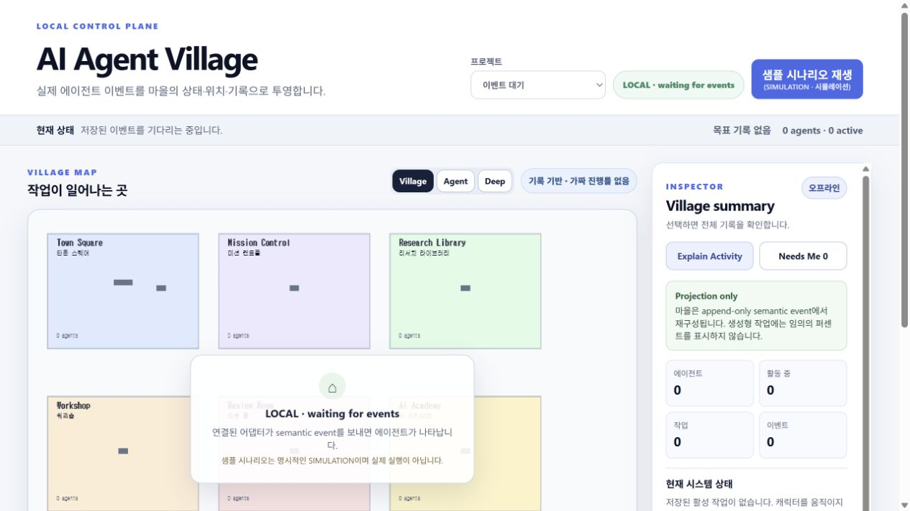

<!-- JUWON-PORTFOLIO-INTRO:START -->
# AI Agent Village



*Recorded pixel-company UI preview; agent server not connected; simulation not exercised.*

*기존 픽셀 회사 UI · 에이전트 서버 미연결 · 시뮬레이션 미실행*

## English

A standalone local AI-agent activity viewer with a pixel village, event-based movement, and inspectable work states. Simulation is explicitly distinguished from real provider events.

[View JUWON's portfolio](https://jupt.pages.dev/) · [Browse the project collection](https://jupt.pages.dev/projects)

**Scope:** This README presents the repository's documented intent and recorded visual evidence. It does not certify that every feature is complete, deployed, or currently working. Follow the original setup, safety, and license documentation below.

This repository is a selected original-source snapshot. The recorded source fingerprint describes the initial publication; this portfolio introduction was added afterward. Original technical documentation is preserved below.

## 한국어

AI 직원과 협업 상태를 보여주는 3D·픽셀 회사 세계.

[JUWON 포트폴리오 보기](https://jupt.pages.dev/) · [전체 프로젝트 보기](https://jupt.pages.dev/projects)

**확인 범위:** 저장소의 문서상 목적과 기록된 화면 근거를 소개합니다. 모든 기능의 완성·배포·현재 정상 작동을 보증하지 않습니다. 설치법·안전 주의사항·라이선스는 아래 기존 문서를 확인하세요.

선택된 원본 소스의 공개 스냅샷입니다. 기록된 소스 지문은 최초 공개 시점을 나타내며, 이 포트폴리오 소개는 이후 추가했습니다. 기존 기술 문서는 아래에 보존했습니다.
<!-- JUWON-PORTFOLIO-INTRO:END -->

---

## Original documentation / 기존 문서

# AI Agent Village — standalone local host

AI Agent Village is a separate local app for seeing real AI-agent work as a readable village. It is not embedded in JUWON COMMAND and does not change the existing company OS.

## Run

```powershell
rtk node server.js --port 4988
```

Windows에서는 `start.cmd`를 더블클릭해도 됩니다.

Open [http://127.0.0.1:4988/](http://127.0.0.1:4988/). The server binds to loopback only.

## What works now

- Seven rooms: Town Square, Mission Control, Research Library, Workshop, Review Room, AI Academy, and Archive.
- Canonical event projection for projects, agents, tasks, runs, tool calls, messages, handoffs, artifacts, reviews, user-input requests, completion, and errors.
- Semantic agent states, deterministic A* movement, and a Canvas 2D pixel world. Characters walk, face one another, talk with short bubbles, carry artifacts, and wait in Review Room only when the event log says so. No random wandering and no invented generative-work percentages.
- Agent/room/event/task/artifact/dependency/conversation inspector, important-event feed, Explain Activity, Needs Me, keyboard selection, responsive layout, and reduced-motion support.
- `GET /api/state`, `GET /api/events`, `GET /api/realtime` (SSE), `POST /api/events`, `POST /api/ingest`, `POST /api/demo`, and `GET /healthz`.
- `POST /api/ingest` is the safe provider boundary. It accepts one OpenAI, Codex, Hermes, CrewAI, n8n, user, or system record, maps common provider event names to the canonical contract, and immediately broadcasts the result through SSE.
- The sample button is explicitly labelled **SIMULATION**. It creates a deterministic, inspectable planning → collaboration → research → physical handoff → artifact → review → approval → archive trace. The 140ms event cadence makes each semantic movement visible while the server remains the source of truth.
- Event input validates the semantic contract and rejects secrets, browser credentials, and tokens.

## Truth boundary

This first localhost is an adapter-ready visual/event core. It does **not** claim a live Hermes Gateway, Hermes history import, ChatGPT export import, or live ChatGPT bridge. Connect one provider by sending durable records to `POST /api/ingest`; the UI will update through SSE. The loopback server appends events to `data/events.jsonl`, so a refresh or server restart reconstructs the current village.

The UI shows short summaries in the village and keeps full event/message content in the inspector. It never displays chain-of-thought or accepts provider secrets.

`pixel-world-model.js` owns the fixed 64×36 map, room anchors, stable slots, A* paths, and interaction phases. `pixel-world-engine.js` owns only 60fps Canvas drawing and consumes immutable snapshots; it never fetches or runs commands.

## Example event

```json
{
  "type": "AGENT_STATUS_CHANGED",
  "projectId": "project-1",
  "agentId": "agent-1",
  "payload": {
    "state": "RESEARCHING",
    "roomId": "research-library",
    "taskId": "task-1"
  }
}
```

### Provider ingest example

```json
{
  "provider": "hermes",
  "projectId": "project-1",
  "runId": "run-1",
  "event": {
    "type": "message.created",
    "agentId": "hermes-1",
    "payload": {
      "channel": "collaboration",
      "body": "Three verified sources.",
      "worldSummary": "Hermes reports evidence to Planner."
    }
  }
}
```

Post that JSON to `http://127.0.0.1:4988/api/ingest`. The adapter emits `MESSAGE_CREATED` with `source: "hermes"`; secrets and private reasoning fields are rejected before persistence.

## Files

- `server.js` — loopback HTTP server, event core, JSON API, SSE, and labelled demo.
- `provider-adapter.js` — provider-neutral ingest normalizer for OpenAI/Codex/Hermes/CrewAI/n8n records; no external network calls.
- `public/model.js` — pure canonical-to-village projection.
- `public/pixel-world-model.js` — fixed map, collision cells, A*, movement intents, collaboration/handoff reducer.
- `public/pixel-world-engine.js` — Canvas pixel renderer and animation state machine.
- `public/index.html`, `public/styles.css`, `public/app.js` — standalone UI, accessible agent selection, SSE, and Inspector.
- `docs/superpowers/plans/2026-08-30-ai-agent-village-localhost.md` — implementation plan.
- `docs/superpowers/specs/2026-08-30-ai-agent-village-pixel-world-design.md` — approved pixel-world design.
- `docs/superpowers/plans/2026-08-30-ai-agent-village-pixel-world.md` — pixel-world implementation plan.

## Verification

```powershell
rtk node --test provider-adapter.node-test.js public/model.node-test.js public/pixel-world-model.node-test.js public/pixel-world-engine.node-test.js public/app.node-test.js server.node-test.js
rtk node --check server.js
rtk node --check public/app.js
```
